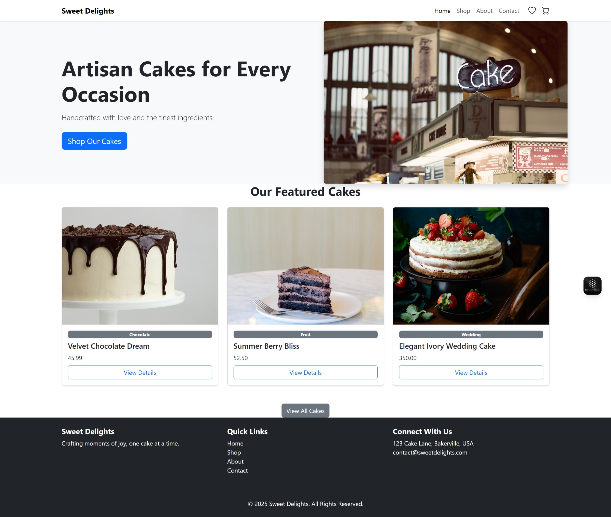
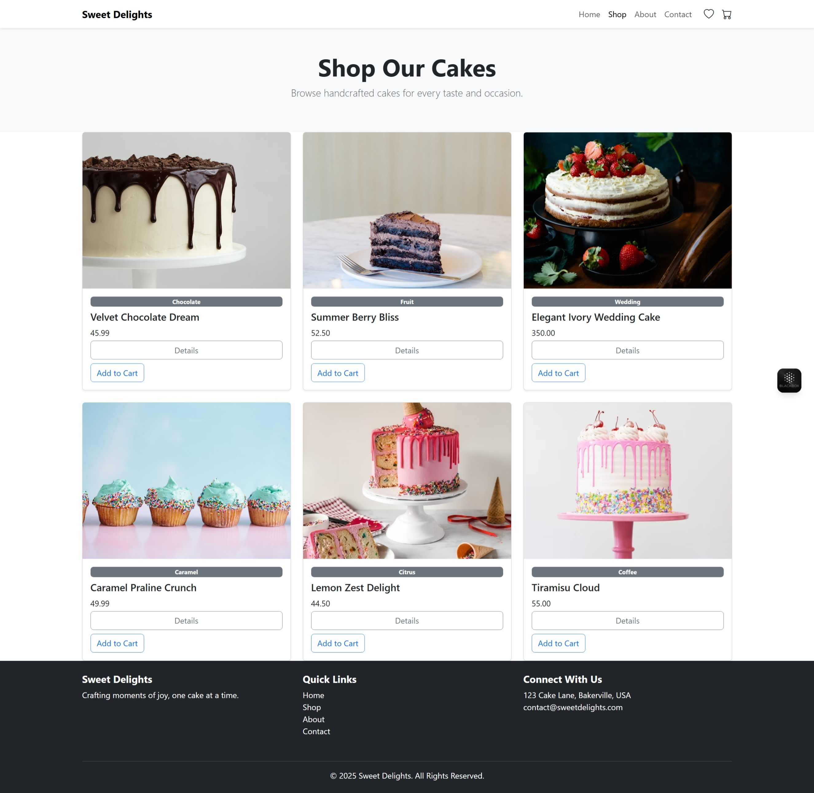
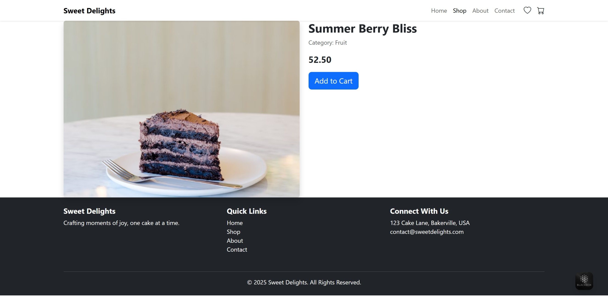
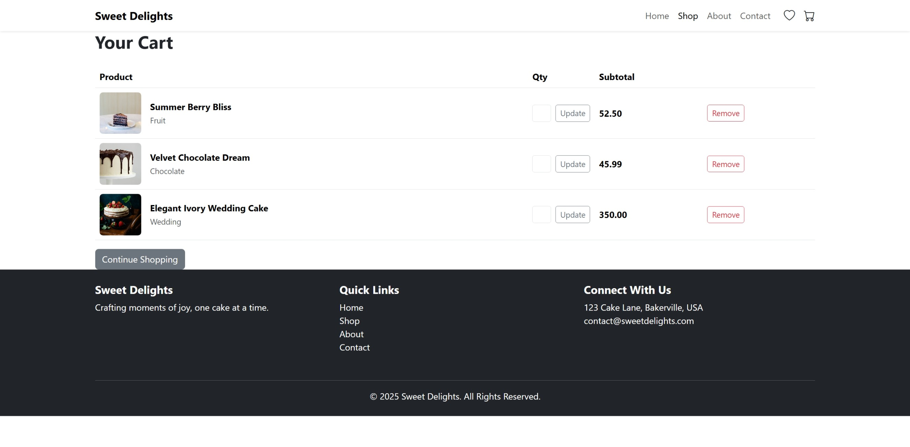
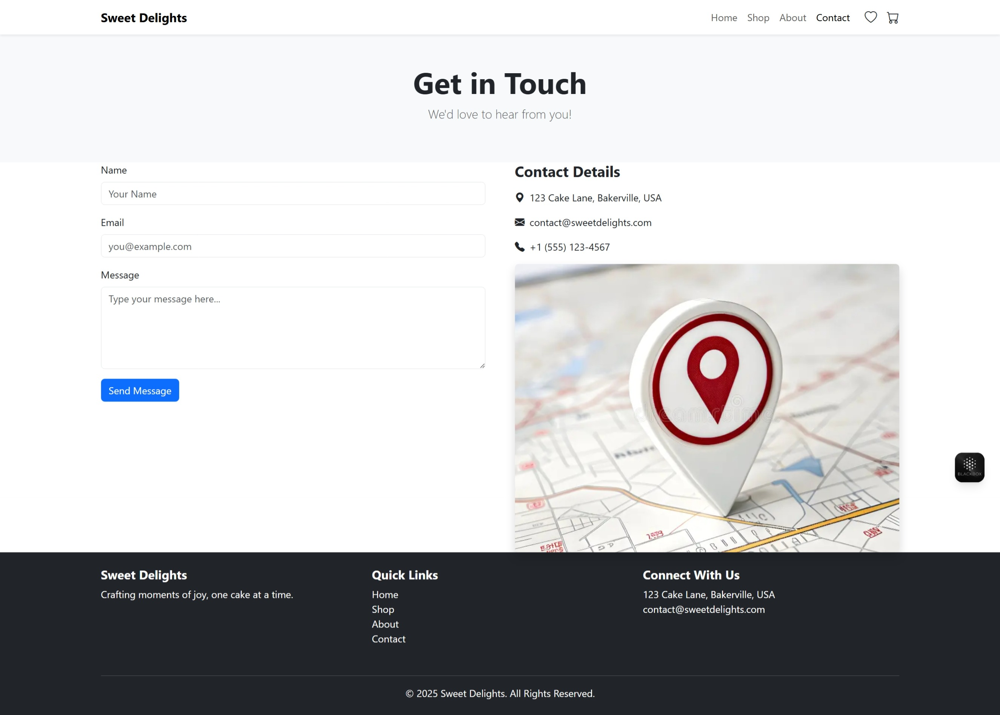

<!-- Banner: replace with your own image under /assets -->

<p align="center">
  
</p>

<h1 align="center">Sweet Delights — Java Web App (Spring Boot + Thymeleaf + Bootstrap 5.3)</h1>

<p align="center">
  <b>Assignment 7: Rebuild the Cake Shopping Website using Java</b><br/>
  Spring Boot • Spring MVC • Thymeleaf • Bootstrap 5.3 • Session Cart • Light/Dark/Auto Theme
</p>

---

## 📸 Preview

<p align="center">
  
</p>
<p align="center">
  
</p>
<p align="center">
  
</p>
<p align="center">
  
</p>
<p align="center">
  
</p>

> **Tip:** Replace these images with your own screenshots at the same paths under `/assets`.

---

## ✨ What’s inside

* **Full Java web app** using **Spring Boot 3** (embedded Tomcat) and **Thymeleaf** templates
* **Bootstrap 5.3** UI (responsive, accessible) with **Light/Dark/Auto** theme toggle
* **Session-based shopping cart** (add / update qty / remove)
* **In-memory product catalog** for easy marking & demos (swap to DB later if needed)
* **Clean componentized templates** (head, navbar, footer) + polished CSS for consistent cards/images
* **Single runnable JAR** for easy academic submission + screenshots

---

## 🧭 Table of Contents

* [Project Goals](#project-goals)
* [Tech Stack](#tech-stack)
* [Architecture](#architecture)
* [Project Structure](#project-structure)
* [Getting Started](#getting-started)

  * [Prerequisites](#prerequisites)
  * [Clone & Run (Dev)](#clone--run-dev)
  * [Build a Runnable JAR](#build-a-runnable-jar)
* [Usage](#usage)
* [Screenshots for Submission](#screenshots-for-submission)
* [Dark/Light/Auto Theme](#darklightauto-theme)
* [Troubleshooting](#troubleshooting)
* [Next Steps / Extra Credit](#next-steps--extra-credit)
* [License](#license)

---

## Project Goals

Rebuild the original **Bootstrap cake shopping website** as a **Java** application while preserving visuals and UX, and adding a server-side backend:

* Keep the look-and-feel of the first assignment
* Add real routes/controllers, dynamic rendering, and a session cart
* Package as a reproducible Maven project
* Produce screenshots of the main pages for submission

---

## Tech Stack

* **Java 17**, **Maven 3.9+**
* **Spring Boot 3** (Web/MVC, Thymeleaf)
* **Thymeleaf 3** templates (natural HTML)
* **Bootstrap 5.3** + **Bootstrap Icons**
* **Embedded Tomcat** (no external server needed)

---

## Architecture

* **Controllers (Spring MVC)**

  * `/` (home) — featured products
  * `/shop` — catalog grid
  * `/product/{id}` — product detail
  * `/cart` — view/update cart; `POST /cart/add/{id}`, `POST /cart/update/{id}`, `POST /cart/remove/{id}`
  * `/about`, `/contact` — static pages
* **Templates (Thymeleaf)** in `src/main/resources/templates` with fragments for `head`, `navbar`, `footer`
* **Static assets** in `src/main/resources/static` (CSS/images)
* **Data** via `InMemoryProductRepository` (swap to DB later)
* **Session cart** stored as `Map<Long,Integer>` in `HttpSession`

---

## Project Structure

```text
sweet-delights-java/
├─ pom.xml
├─ src/
│  ├─ main/java/com/example/sweetdelights/
│  │  ├─ SweetDelightsApplication.java
│  │  ├─ model/
│  │  │  └─ Product.java
│  │  ├─ repo/
│  │  │  └─ InMemoryProductRepository.java
│  │  └─ web/
│  │     ├─ HomeController.java
│  │     ├─ ShopController.java
│  │     ├─ ProductController.java
│  │     ├─ CartController.java
│  │     └─ SimplePageController.java  # /about, /contact
│  └─ main/resources/
│     ├─ application.properties
│     ├─ templates/
│     │  ├─ fragments/
│     │  │  ├─ head.html
│     │  │  ├─ navbar.html
│     │  │  └─ footer.html
│     │  ├─ index.html
│     │  ├─ shop.html
│     │  ├─ product.html
│     │  ├─ cart.html
│     │  ├─ about.html
│     │  └─ contact.html
│     └─ static/
│        ├─ css/styles.css
│        └─ images/
│           ├─ hero-cake.jpg, cake1.jpg .. cake6.jpg
│           ├─ about-us.jpg, map-placeholder.jpg
│           └─ (add your own)
└─ assets/
   ├─ banner.png
   ├─ preview-home.png
   ├─ preview-shop.png
   ├─ preview-product.png
   ├─ preview-cart.png
   └─ preview-themes.png
```

> Note: `/assets` is only for README images. App images live under `/static/images`.

---

## Getting Started

### Prerequisites

* **JDK 17** (Temurin/OpenJDK recommended)
* **Maven 3.9+**

### Clone & Run (Dev)

```bash
# 1) Clone
git clone https://github.com/AbdullahWB/JavaWebDev.git
cd sweet-delights-java

# 2) (Optional) place screenshots under /assets
# 3) Run in dev
mvn spring-boot:run

# Open in browser
http://localhost:8080/
```

### Build a Runnable JAR

```bash
mvn clean package
java -jar target/sweet-delights-java-1.0.0.jar
# then visit http://localhost:8080/
```

> If you added **DevTools**, template caching is off in dev. Otherwise set:
>
> ```properties
> # src/main/resources/application.properties
> spring.thymeleaf.cache=false
> server.port=8080
> ```

---

## Usage

* **Home** (`/`) — hero + featured products
* **Shop** (`/shop`) — full catalog grid
* **Product** (`/product/{id}`) — product detail with Add to Cart
* **Cart** (`/cart`) — view/update/remove items
* **About** (`/about`) and **Contact** (`/contact`) — static pages

**Navigation & Layout**

* Reusable `head`, `navbar`, `footer` fragments keep pages consistent
* Clean CSS for equal-height cards and uniform image crops (Bootstrap `ratio` + `object-fit: cover`)

---

## Screenshots for Submission

Take these screenshots and place them in `/assets` (or your report):

* `preview-home.png` — Home (hero + featured)
* `preview-shop.png` — Shop grid
* `preview-product.png` — Product detail
* `preview-cart.png` — Cart page
* `preview-themes.png` — Theme dropdown (Light/Dark/Auto)

*(Windows: Win+Shift+S, macOS: Shift+Cmd+4, Linux: use your screenshot tool)*

---

## Dark/Light/Auto Theme

* Bootstrap 5.3 color modes via `data-bs-theme` on `<html>`
* Early inline script sets theme **before CSS** to avoid flash
* Navbar dropdown to select **Light / Dark / Auto**
* Preference stored in `localStorage`; “Auto” tracks OS setting (`prefers-color-scheme`)
* Custom palette adapted in dark mode using CSS variables

---

## Troubleshooting

**App fails to start with** `Invalid boolean value 'false   # dev-friendly'`
→ In `.properties`, comments must be on their own line. Use:

```properties
spring.thymeleaf.cache=false
```

**Static assets 404**
→ Ensure images/CSS are under `src/main/resources/static` and referenced with `/images/...` or `/css/styles.css`.

**Port already in use**
→ Change the port in `application.properties`:

```properties
server.port=8081
```

**Template not found**
→ Confirm the file exists under `src/main/resources/templates` and your controller returns the correct view name.

---

## Next Steps / Extra Credit

* Add search/filter on `/shop` (by category or price)
* Implement checkout form with server-side validation
* Switch to **JPA + H2** or **PostgreSQL** for real persistence
* Add basic authentication for admin product management
* Containerize with Docker for easy deployment

---

## License

This project is provided for educational purposes. Add your preferred license (MIT, Apache-2.0, etc.) if you intend to distribute.
